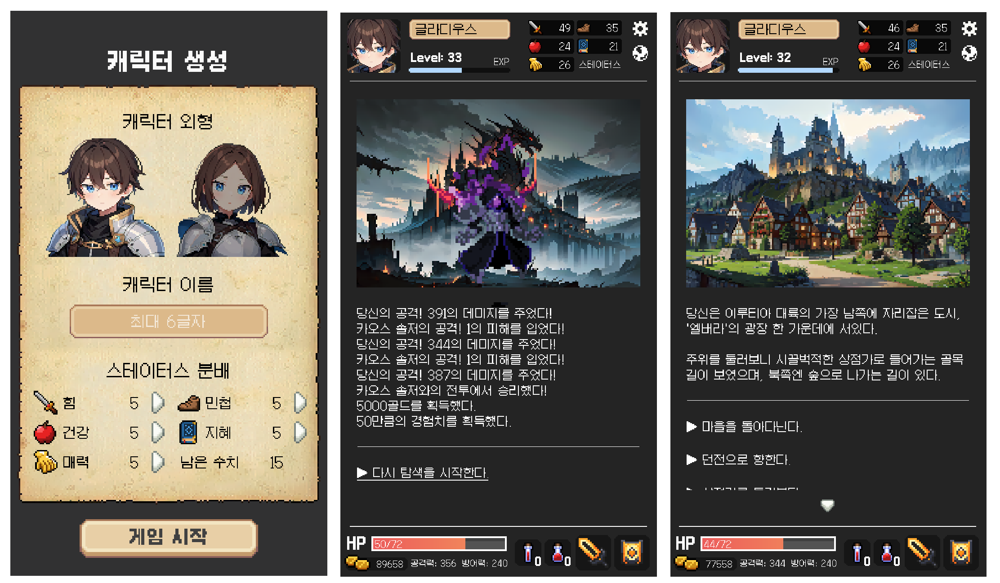

# 일곱 용의 노래 : 바하무트를 향한 서곡
<br>



```
Chat GPT와 Stable Diffusion AI로 개발하는 모바일 텍스트 RPG
```

동양미래대학교 ChatGPT 챌린지 출품작 <br>
ChatGPT와 Stable Diffusion만으로 게임 만들기

<hr>

### ChatGPT 사용 내역
- 게임 기획
  - 캐릭터 디자인
  - 몬스터, 던전 디자인
  - 던전 탐색 이벤트 설계
- 시나리오 라이팅
  - 프롤로그, 엔딩 시나리오 라이팅
  - 모든 소설형 텍스트 라이팅
  - 아이템 설명 작성
- 프로그래밍
  - 대부분의 메서드, 스크립트, 프로퍼티 작성
  - 디자인 패턴 적용
- 디자인
  - Stable Diffusion 프롬프트 생성
- QA
  - 밸런싱
  - 레벨 디자인

### Stable Diffusion 사용 내역
- 게임의 모든 일러스트 생성
- 게임 캐릭터 외형 생성

### 게임 빌드 파일
- 본 게임은 모바일 / PC 모두 구동 가능한 크로스 플랫폼 게임
- [APK 파일 (권장)](https://drive.google.com/file/d/1ZmY7oQl996tC_Y4rDK3e5dSPqO2oZtD4/view?usp=sharing)
- [PC 버전](https://drive.google.com/file/d/1EL_yoAYwecf4FlQfQK-PCTnrDEF-otn9/view?usp=sharing)